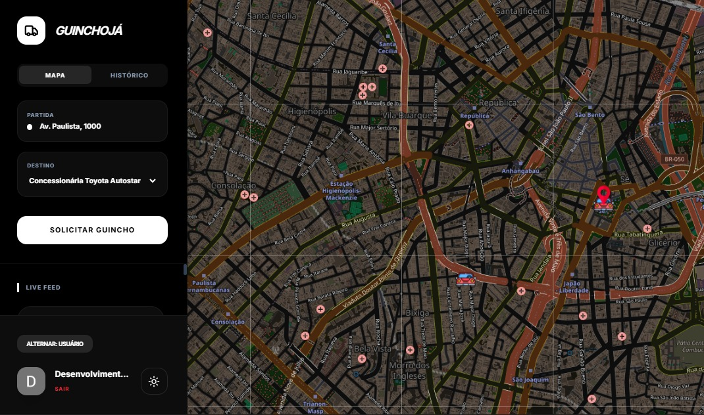
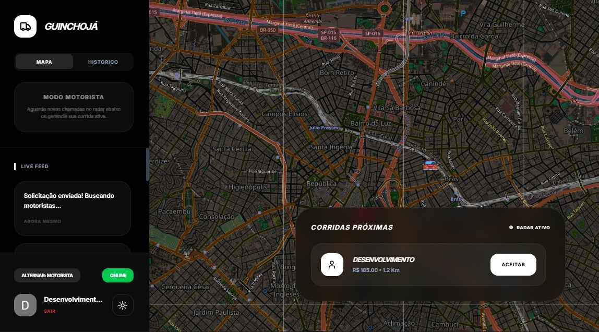
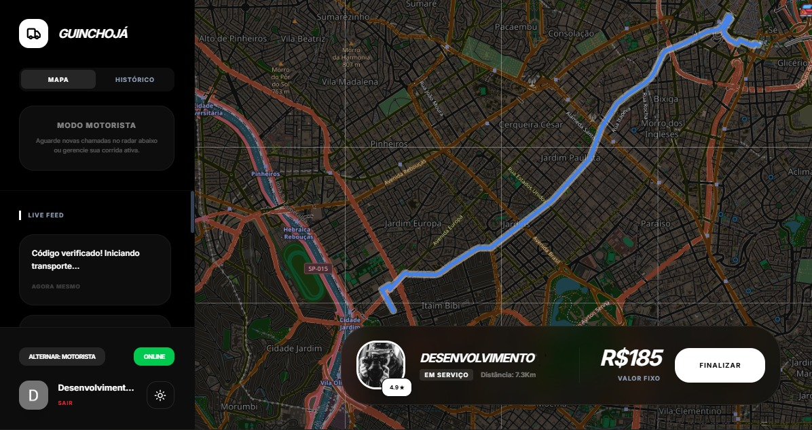

# Guincho Já

## Descrição do Projeto

O **Guincho Já** é um aplicativo web moderno para solicitação de serviços de guincho (reboque de veículos). A plataforma conecta clientes que precisam de assistência veicular com motoristas de guincho disponíveis, oferecendo uma experiência intuitiva e em tempo real.

### Funcionalidades Principais

- ✅ **Solicitação de Guincho**: Clientes podem solicitar reboque informando localização de origem e destino, detalhes do veículo e preferências.
- 🗺️ **Rastreamento em Tempo Real**: Mapa interativo mostra a localização dos motoristas e o progresso do serviço, utilizando um sistema de mapas open-source e gratuito (Leaflet).
- 🔐 **Autenticação Segura**: Sistema de login via conta Google para acesso seguro à plataforma com Firebase Authentication.
- 👥 **Perfis de Usuário**: Diferenciação entre clientes e motoristas com perfis personalizados.
- 🏪 **Destinos Pré-Definidos**: Concessionárias e mecânicos já registrados aparecem no mapa para facilitar a escolha de um destino rápido.
- 🧾 **Código de Segurança**: O solicitante fornece um código para iniciar a corrida, garantindo proteção contra acessos não autorizados.
- 🚫 **Modo Offline para Motoristas**: Motoristas podem ficar offline quando não desejam receber novas corridas.
- 📜 **Histórico de Corridas**: Sistema de histórico completo para motoristas e solicitantes, permitindo visualizar corridas passadas.
- 🔄 **Live Feed**: Feed em tempo real atualizando o usuário sobre os últimos eventos e atualizações no app.
- ⭐ **Avaliações**: Sistema de estrelas para avaliar motoristas após o serviço.

### Tecnologias Utilizadas

- **Frontend**:
  - **React 19**: Biblioteca JavaScript para construção de interfaces de usuário.
  - **TypeScript**: Superset do JavaScript com tipagem estática.
  - **Vite**: Ferramenta de build rápida para desenvolvimento moderno.
  - **Tailwind CSS**: Framework CSS utilitário para estilização.
  - **Leaflet**: Biblioteca para mapas interativos.
  - **React Leaflet**: Integração do Leaflet com React.
  - **Lucide React**: Ícones vetoriais.
  - **Motion**: Biblioteca de animações para React.

- **Backend e Infraestrutura**:
  - **Firebase**: Plataforma de desenvolvimento de apps.
    - **Firestore**: Banco de dados NoSQL em tempo real.
    - **Authentication**: Sistema de autenticação.
  - **Google Maps API**: Para geocodificação e mapas (opcional).

- **Ferramentas de Desenvolvimento**:
  - **ESLint**: Linter para JavaScript/TypeScript.
  - **Vite Plugin React**: Plugin para integração com React.
  - **Autoprefixer**: Para prefixos CSS automáticos.

## Estrutura do Projeto

```
guincho-ja/
├── src/
│   ├── components/     # Componentes React reutilizáveis
│   │   ├── Map.tsx     # Componente de mapa interativo
│   │   └── ThemeContext.tsx # Contexto para tema claro/escuro
│   ├── hooks/          # Hooks customizados
│   │   └── useTowRequests.ts # Hook para gerenciar pedidos de guincho
│   ├── lib/            # Utilitários e configurações
│   │   ├── firebase.ts # Configuração do Firebase
│   │   └── utils.ts    # Funções utilitárias
│   ├── services/       # Serviços e dados mock
│   │   └── mockData.ts # Dados de exemplo para desenvolvimento
│   ├── types/          # Definições de tipos TypeScript
│   │   └── index.ts    # Tipos principais da aplicação
│   ├── App.tsx         # Componente principal da aplicação
│   ├── main.tsx        # Ponto de entrada da aplicação
│   └── index.css       # Estilos globais
├── docs/               # Documentação e screenshots
│   ├── screenshots/    # Capturas de tela do aplicativo
│   │   ├── driver/     # Screenshots da visão do motorista
│   │   └── requester/  # Screenshots da visão do solicitante
│   └── metadata.json   # Metadados do projeto
├── firebase/           # Configurações do Firebase
│   ├── firebase-applet-config.json # Configuração do Firebase (applet)
│   ├── firebase-blueprint.json     # Blueprint do Firebase
│   └── firestore.rules # Regras de segurança do Firestore
├── public/             # Arquivos estáticos
├── dist/               # Build de produção (gerado)
├── package.json        # Dependências e scripts
├── tsconfig.json       # Configuração do TypeScript
├── vite.config.ts      # Configuração do Vite
├── .gitignore          # Arquivos ignorados pelo Git
├── .env.example        # Exemplo de variáveis de ambiente
├── index.html          # Página HTML principal
└── README.md           # Este arquivo
```

## Como Executar o Projeto

### Pré-requisitos

- **Node.js** (versão 20 ou superior recomendada)
- **npm** ou **yarn**
- Conta no **Firebase** para configurar autenticação e banco de dados

### Instalação

1. Clone o repositório:
   ```bash
   git clone https://github.com/seu-usuario/guincho-ja.git
   cd guincho-ja
   ```

2. Instale as dependências:
   ```bash
   npm install
   ```

3. Configure o Firebase:
   - Crie um projeto no [Firebase Console](https://console.firebase.google.com/)
   - Habilite Authentication (com Google provider) e Firestore
   - Copie as configurações do SDK para `src/lib/firebase.ts`
   - Configure as regras de segurança no Firestore (veja `firestore.rules`)

4. (Opcional) Configure variáveis de ambiente:
   - Crie um arquivo `.env.local` na raiz do projeto
   - Adicione chaves de API necessárias (ex: Google Maps API key)

5. Execute o projeto em modo de desenvolvimento:
   ```bash
   npm run dev
   ```

6. Abra o navegador em `http://localhost:3000`

### Build para Produção

```bash
npm run build
npm run preview
```

### Scripts Disponíveis

- `npm run dev`: Inicia o servidor de desenvolvimento
- `npm run build`: Gera build de produção
- `npm run preview`: Visualiza o build de produção localmente
- `npm run lint`: Executa linting do código TypeScript
- `npm run clean`: Remove arquivos de build

## Documentação da Aplicação

### Componentes Principais

- **App.tsx**: Componente raiz que gerencia autenticação, tema e navegação principal.
- **Map.tsx**: Mapa interativo usando Leaflet para visualização de localizações e rotas.
- **ThemeContext.tsx**: Provedor de contexto para alternância entre temas claro e escuro.

### Hooks

- **useTowRequests**: Hook para gerenciar estado e operações relacionadas aos pedidos de guincho, incluindo criação, atualização e sincronização com Firestore.

### Tipos

Os tipos TypeScript estão definidos em `src/types/index.ts` e incluem:
- `UserRole`: 'customer' | 'driver'
- `TowRequest`: Interface para pedidos de guincho
- `UserProfile`: Perfil do usuário
- `Location`: Coordenadas e endereço

### Serviços

- **Firebase**: Configurado em `src/lib/firebase.ts` para autenticação e banco de dados.
- **Mock Data**: Dados de exemplo em `src/services/mockData.ts` para desenvolvimento sem backend.

### Segurança

- Autenticação obrigatória para todas as operações
- Regras de segurança no Firestore para controle de acesso
- Validação de dados no frontend e backend

## Screenshots

Abaixo, apresentamos capturas de tela ilustrativas do fluxo completo de uso do aplicativo, dividido pelas perspectivas do solicitante (usuário que precisa do guincho) e do motorista (que atende o pedido). Cada imagem descreve uma etapa do processo.

### Processo do Solicitante (Requester)

1. **Tela de Solicitação Inicial**: O usuário acessa a interface para criar um novo pedido de guincho, informando origem, destino e detalhes do veículo.  
   

2. **Pedido Aceito pelo Motorista**: Após o motorista aceitar o pedido, o solicitante recebe confirmação, o código, e pode acompanhar o status em tempo real.  
   

3. **Avaliação da Corrida**: Ao final do serviço, o solicitante pode avaliar o motorista com estrelas e comentários.  
   

### Processo do Motorista (Driver)

1. **Início da Corrida**: O motorista visualiza o pedido, aceita e se prepara para iniciar o serviço, com informações sobre o cliente e rota.  
   

2. **Chegada ao Local**: O motorista confirma a chegada ao local de origem do veículo.  
   

3. **Inserção do Código de Segurança**: Para iniciar a corrida, o motorista deve inserir o código fornecido pelo solicitante, garantindo segurança.  
   

4. **Fim da Corrida**: Após completar o reboque, o motorista finaliza a corrida e registra o término.  
   

## Contribuição

1. Fork o projeto
2. Crie uma branch para sua feature (`git checkout -b feature/nova-feature`)
3. Commit suas mudanças (`git commit -am 'Adiciona nova feature'`)
4. Push para a branch (`git push origin feature/nova-feature`)
5. Abra um Pull Request

## Contato

Para dúvidas ou sugestões, abra uma issue no GitHub ou entre em contato com a equipe de desenvolvimento.
